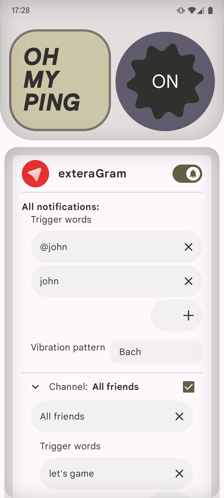
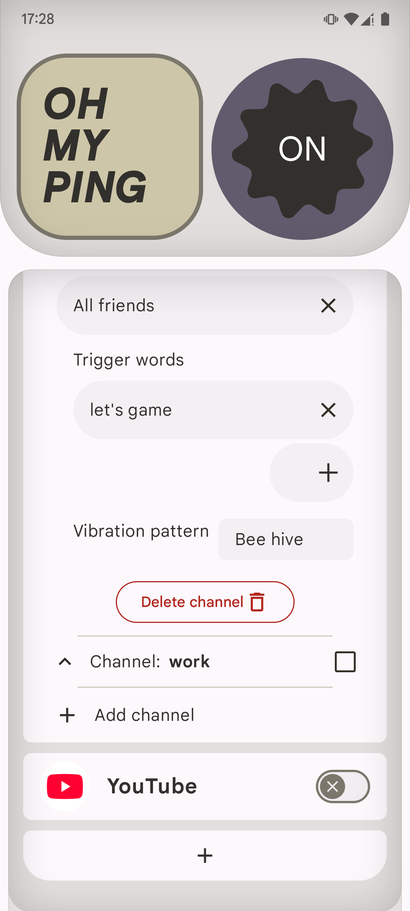

# OhMyPing
Sometimes you get so many notifications from group chats that you start ignoring them. Then when someone specifically mentions you, you might miss it because the notification looks just like all the others.

**This app reads all incoming notifications and alerts you with a custom vibration pattern when it detects your trigger words. You can set unique trigger words (like your nickname or name) and vibration patterns for each app and notification channel.**

